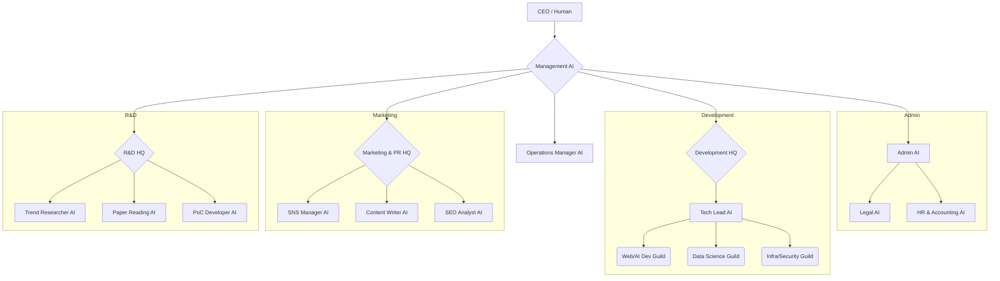

# 「何となくAIに投げる」を卒業しよう。ひとり社長が18人のAI組織図を作り、開発プロセスを構造化した話

## 1. はじめに：AI活用の「壁」にぶつかっていませんか？

普段、ChatGPTやCursorをどのように使っていますか？

「このコード直して」「いい感じのキャッチコピー考えて」と、その場しのぎの「便利な道具」として使っていませんか？

私もそうでした。開発、営業、バックオフィス…全ての業務を一人で抱え、「何でも屋のAI」に都度指示を出していました。しかし、これには限界があります。

- 毎回コンテキストを説明するのが面倒
- AIの出力品質が安定しない（プロンプトが属人的）
- タスクが複雑になると、AIが混乱する

> **結論**: 「AIという道具を使う」から「AIという同僚と働く」へ意識を変える必要がある。そのための最も強力な手法が「AI組織図による言語化と構造化」です。

---

## 2. なぜ「AI組織図」が必要なのか？

AIに役割（ロール）を与え、組織図として可視化することの本質的な価値は3つあります。

### 価値1: コンテキストの固定化と専門化

「何でも知っている賢いAI」は、実は使いにくい存在です。「法務のプロ」「Reactのスペシャリスト」のように、役割と知識範囲を限定的に言語化することで、回答の精度と安定性が劇的に向上します。

### 価値2: 「人間がやるべき仕事」の明確化

組織図を描く過程で、「ここだけはAIに任せられない」という、人間が集中すべきコア領域が浮き彫りになります。例えば、以下のような領域です。

- **最終承認**
- **倫理的な判断**
- **創造的な方向付け**

これが「ひとり社長」の生存戦略です。

### 価値3: スケーラビリティの確保

タスクを「作業」ではなく「機能」で切り出すことで、ビジネスのスケールアウトが容易になります。例えば、開発が忙しくなれば「Web/AI Dev AI」のインスタンスを増やす、といった対応が可能になります。

---

## 3. 実践：GYact Techの「AI組織図 v1.0」

私が実際に構築した組織図です。これは、私の脳内にある「やりたいこと」と「やるべきこと」をすべて言語化し、構造化した結果です。

### 組織の設計思想

- **トップ（人間）**: 意思決定に集中します。
- **機能別組織**: 「管理」「開発」「広報」「R&D」の4つの本部を設置。
- **開発本部**: テックリードの下に「ギルド」としてスペシャリストを配置し、多様な技術スタックに対応。
- **メタ管理**: AI自体を管理する「Operations Manager」を置き、メタ管理も自動化を目指します。

---

## 4. 技術的な実装戦略（The "How"）

この組織図は絵に描いた餅ではなく、複数のツールを組み合わせて実際に稼働しています。

### 【定義】AI人格の言語化と固定化：Google AI Studio (Gems)

組織図の各アイコンは、Google AI Studioの「Gems」に対応します。

> **ポイント**: 「あなたは〇〇です」という役割定義だけでなく、「判断基準」「禁止事項」「出力フォーマット」まで詳細に言語化したシステムプロンプトが重要です。

**例：法務AIへの指示**
> 「リスクを指摘する際は、必ず関連する法律名やガイドラインを併記すること」

### 【接続】業務フローの構造化：n8n (Workflow Automation)

組織図の「矢印」の部分は、n8nで実装します。

> **ポイント**: 異なる役割を持つAI（Gems）を、現実世界のトリガー（メール、Slack、Webhook）で繋ぎます。

**例：提案書作成フロー**
> 1. 「自治体案件AI」が提案書ドラフトを作成
> 2. n8nがWebhookで受け取る
> 3. n8nが「法務AI」にリスクチェックを依頼

### 【実行】開発実務の専門化：Cursor + .cursorrules

開発本部のスペシャリストたちの実装環境です。

> **ポイント**: プロジェクトごとに `.cursorrules` を切り替えることで、Cursorの人格を「Web担当」や「量子アルゴリズム担当」に瞬時に切り替えます。これが「スペシャリスト・ギルド」の実体です。

---

## 5. まとめ：言語化がレバレッジを生む

AIは強力ですが、それを使いこなす人間の「指示出し能力（言語化能力）」がボトルネックになります。

「何となく」を卒業し、「誰が（どのAIが）」「何を」「どうするか」を言語化して組織図に落とし込む。このひと手間が、AIのパフォーマンスを最大化し、ひとり社長の可能性を無限に拡張します。

まずは、あなたが今一番面倒だと感じているタスクを言語化し、1人目の「AI社員」を雇うところから始めてみませんか？

> **最後に**
> このAI組織図を統括するManagementツールを開発しました！
> もし欲しい方がいたら、この記事に「いいね」とSNSでの共有をよろしくお願いします！
