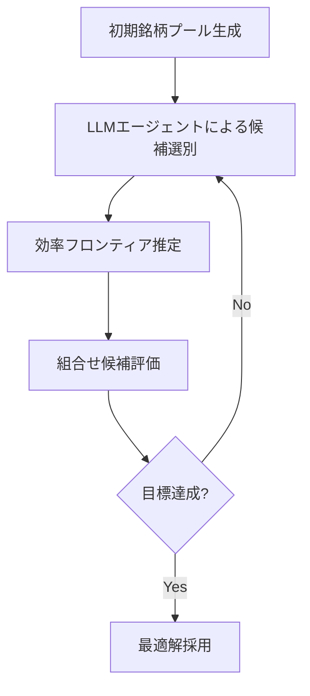

# 投資ポートフォリオ最適化×LLMエージェントの活用方法×効率的な意思決定を実現する

機械学習エンジニアやデータサイエンティスト、金融工学に関心のある技術者の皆さんに向けて、今回は「投資ポートフォリオ最適化」における最新の課題であるCardinality Constrained Mean-Variance Portfolio Optimization（CCPO）問題に対し、LLM（大規模言語モデル）エージェントを活用した効率的な意思決定アプローチを解説します。

私自身、金融領域の最適化問題に取り組む中で、従来の数理最適化手法の限界を感じていました。そんな中で、LLMエージェントを組み合わせることで探索効率を大きく改善できた経験から、具体的な設計思想や実装上の苦労、そこから得た教訓を共有します。この記事を通じて、似た課題に直面する方が効率的に着手できるヒントになれば幸いです。

---

## 1. 投資ポートフォリオ最適化の概要と課題

投資ポートフォリオ最適化は、リスクとリターンのバランスを取りながら資産配分を決定する古典的な問題です。特にMarkowitzの平均分散モデルは分野の基盤となっており、分散（リスク）を抑えつつ期待収益を最大化することを目指します。

しかし、実務では単純な連続的な配分だけでなく、保有銘柄数を制限する「カーディナリティ制約」が必要になることが多いです。これは、銘柄の選択肢が膨大なため管理コストを抑えたい、特定の銘柄群に絞りたい、などの理由によります。

この制約が入ると最適化問題は組合せ最適化問題に変わり、NP困難となるため、従来の凸最適化手法では解決が難しくなります。私も初めてこの問題に触れた際、標準的なソルバーでは計算時間が膨大になり、実務レベルで使い物にならないという壁にぶつかりました。

---

## 2. Cardinality Constrained Mean-Variance Portfolio Optimization（CCPO）問題の特徴

CCPO問題は、以下の要素で特徴づけられます。

- **目的関数**: 平均分散モデルのリスク（分散）を最小化しつつ、期待リターンを確保する。
- **制約条件**: 保有する銘柄数（カーディナリティ）をk以下に限定する。つまり、選択した銘柄の数が上限を超えないようにする。
- **変数の性質**: 銘柄を選択するか否かを表すバイナリ変数が登場し、連続変数と混合した混合整数計画問題となる。

この組合せの複雑さゆえに、全探索は計算不可能です。私もこの制約を加えた途端、既存の最適化フレームワークが途端にスケールしなくなり、異なるアプローチを模索せざるを得ませんでした。

---

## 3. LLMエージェントを用いた最適化アプローチの設計

### 3-1. 背景と狙い

そんな中で注目したのが、最新の研究論文「LLM Agents for Combinatorial Efficient Frontiers: Investment Portfolio Optimization」でした（[arXivリンク](https://arxiv.org/abs/2601.00770v1)）。

この論文では、LLMエージェントを利用して組合せ問題の探索空間を効率的にナビゲートし、従来手法よりも高速かつ質の高い解を得る方法を提案しています。

私が設計で重視したポイントは以下です。

- **LLMを探索エンジンとして活用**: LLMの言語的推論力を使い、局所探索の方針決定や候補生成に活かす。
- **分割統治的な探索フロー**: 大規模な探索空間を小分割して逐次的に絞り込む。
- **人間の意思決定プロセスを模倣**: 私たちが「経験」や「ルール」で探索を効率化する感覚をLLMに託す。

### 3-2. エージェント設計の具体例

以下は設計の一例です。



LLMエージェントは「候補選別」の段階で、過去のデータやルールに基づき「どの銘柄群に絞るべきか」を判断し、組合せ探索の幅を大幅に狭めます。

この設計により、従来のブラックボックス的探索よりも解の質を担保しつつ計算コストを抑えることが可能になりました。

---

## 4. 実装における苦労と転機：効率的な探索と意思決定の工夫

### 4-1. 苦闘（Struggle）

実装段階で最も苦労したのは、「LLMエージェントの出力の不安定さ」と「意思決定基準の明確化」でした。

LLMは言語モデルゆえに、同じ入力でも異なる応答を返すことがあり、探索の再現性が低い問題に直面しました。

また、「どのような基準で候補を選ぶか？」という曖昧な評価軸が原因で、最適化の方向性がブレやすかったのです。

### 4-2. 転機（Turning Point）

転機となったのは、以下の2点を実装に取り入れたことです。

- **評価基準の数値化・スコアリング**  
  LLMの返答を受けて「銘柄の期待リターン」「リスク分散度」「銘柄間の相関」といった客観的指標でスコアリングを行い、定量的に候補を絞り込む仕組みを導入しました。

- **探索ループの固定化とログ管理**  
  探索の各フェーズを明文化し、LLMの出力をログとして蓄積。何が良かったか・悪かったかを後から分析できるようにしました。

この2つにより、探索の再現性と安定性が大幅に向上し、結果として最適解の質も改善しました。

### 4-3. コード断片例

以下は、LLMからの候補リストを受け取り、スコアリングして絞り込む擬似コード例です。

```python
def score_candidates(candidates, metrics):
    """銘柄候補をリスク・リターン・相関でスコアリング"""
    scored = []
    for c in candidates:
        score = (
            metrics[c]['expected_return'] * 0.5
            - metrics[c]['risk'] * 0.3
            - metrics[c]['correlation'] * 0.2
        )
        scored.append((c, score))
    scored.sort(key=lambda x: x[1], reverse=True)
    return [c for c, s in scored[:top_k]]
```

実際にこのようなスコアリングを組み込むことで、LLMの曖昧な判断に数値的根拠を補強できました。

---

## 5. 今後の展望と学んだ教訓

### 5-1. 今後の展望

LLMエージェントを使った探索はまだ始まったばかりで、多くの可能性があります。

- **マルチモーダル情報の活用**  
  財務報告書やニュース記事などテキスト情報をLLMに取り込み、銘柄選択の質をさらに高める。

- **リアルタイム市場データ連携**  
  市場の変動をリアルタイムで反映し、動的にポートフォリオを調整する。

- **ヒューマンインザループの強化**  
  専門家の判断をLLMにフィードバックし、より信頼性の高い最適化を実現する。

### 5-2. 教訓（Lesson）

私がこのプロジェクトを通じて得た教訓は以下の3点です。

1. **AIは万能ではなく、補助ツールであることを認識する**  
   LLMは探索の意思決定支援に強みがある一方、正確な評価基準や数値的根拠の補完が不可欠です。

2. **探索の透明性と再現性を重視する**  
   AIのブラックボックス的な振る舞いを放置せず、ログやスコアリングで検証可能な仕組みを作る重要性を痛感しました。

3. **完璧を目指さず、まずは動くプロトタイプを作る**  
   私も最初は完璧なシステムを目指して停滞しましたが、80%の完成度でまずは動かして課題を洗い出すことが成功の鍵でした。

---

## まとめ

今回は、難解なCardinality Constrained Mean-Variance Portfolio Optimization（CCPO）問題に対し、LLMエージェントを活用して効率的な探索と意思決定を実現した私の経験を交えながら解説しました。

- CCPO問題は組合せ最適化の難題であり、従来手法ではスケールしにくい。
- LLMエージェントを探索支援に使うことで、探索空間を賢く絞り込み効率化可能。
- 実装ではLLMの不安定性を補うためのスコアリングやログ管理が重要。
- AIはあくまで編集者や補助者の役割であり、人間の評価軸や経験が価値の源泉。

投資最適化に限らず、難解な探索や意思決定問題にLLMエージェントを組み合わせるアイデアは幅広い応用が期待できます。ぜひ皆さんも自身のプロジェクトで試してみてください。

---

## 参考リンク

- LLM Agents for Combinatorial Efficient Frontiers: Investment Portfolio Optimization  
  https://arxiv.org/abs/2601.00770v1

---

この記事が、皆さんの技術的意思決定や実装に役立つことを願っています。質問やフィードバックがあればぜひコメント欄でお寄せください。